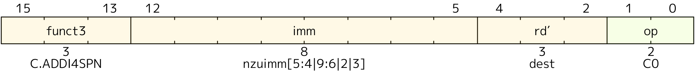

{}
本规范规定了“万众一芯”验证文档的必要形式和结构（不是验证报告的模板），已发布和将来将要发布的文档都需要遵循这一规范。
{}

# 万众一芯验证文档格式规范

验证文档标题请用一号标题格式（一个#），以加法器验证文档为例，其标题可以为：进位加法器设计与验证。

## 文档概述

文档概述标题请用二号标题格式（两个#）。

**【必填项】** 在该部分对整个文档进行简约描述，例如内容概述，待验证模块的基本功能、特殊需求、特定规格、目标读者、知识前置等。目的是通过对该部分，读者便了解是否具有其感兴趣的内容。例如本文档是对验证文档的编写要求进行描述，便于多文档协作，规范验证的数据输入，特定数据标签等。

## 术语说明

术语说明标题请用二号标题格式（两个#）。

**【必填项】** 该部分需要列出术语和关键概念解释，方便读者参考。
1. 优先解释模块专有缩写（如TLB， FIFO等）
2. 对容易混淆的概念请务必明确（如虚拟地址和物理地址等）
3. 示例格式如下：

| 缩写	| 全称 | 定义 |
| -- | ----- | ---|
| TLB	| Translation Lookaside Buffer	| 地址转换的缓存单元，用于加速虚拟地址到物理的转换 |
| FIFO	| First In First Out	| 先进先出队列 |
| QoS	| Quality of Service | 服务质量，用于总线仲裁中优先级控制机制 |

如果有其他补充情况请在此说明，例如：上述命名描述仅针对香山处理器，不代表RISC-V标准或者其他处理器。

## 前置知识

前置知识标题请用二号标题格式（两个#）。

**【可选项】** 在阅读文档或进行验证之前，建议掌握一些关键前置知识，以便更深入理解相关内容。例如，在撰写LoadStoreQueue（LSQ）文档时，讲述RAW（Read After Write）违例有助于理解操作之间的依赖关系。在撰写Icache或L2Cache文档时，介绍缓存层级、替换策略和一致性模型等基本概念也有助于读者理解。如果涉及复杂算法，也应对其进行简要描述。

基本要求：
1. 该部分内容应简洁，易于理解。如篇幅较长，可将内容移至附录。
2. 针对较为复杂的内容，可以通过图像、伪代码和案例进行解释，以降低理解难度。

下面是一个举例：

### st-ld违例
在现代处理器中，Load 和 Store 指令通常采用乱序执行的方式进行处理。这种执行策略旨在提高处理器的并行性和整体性能。然而，由于 Load 和 Store 指令在流水线中的乱序执行，常常会出现 Load 指令越过更早的相同地址的 Store 指令的情况。这意味着，Load 指令本应通过前递（forwarding）机制从 Store 指令获取数据，但由于 Store 指令的地址或数据尚未准备好，导致 Load 指令未能成功前递到 Store 的数据，而 Store 指令已被提交。由此，后续依赖于该 Load 指令结果的指令可能会出现错误，这就是 st-ld 违例。

考虑以下伪代码示例：

```mips
ST R1, 0(R2)  ; 将 R1 的值存储到 R2 指向的内存地址
LD R3, 0(R2)  ; 从 R2 指向的内存地址加载值到 R3
ADD R4, R3, R5 ; 使用 R3 的值进行计算
```

假设在这个过程中，Store 指令由于某种原因（如缓存未命中）未能及时完成，而 Load 指令已经执行并读取了旧的数据（例如，从内存中读取到的值为 `0`）。此时，Load 指令并未获得 Store 指令更新后的值，导致后续计算的数据错误。

通过上述例子，可以清楚地看到 Store-to-Load 违例如何在乱序执行的环境中导致数据一致性问题。这种问题强调了在指令调度和执行过程中，确保正确的数据流动的重要性。现代处理器通过多种机制来检测和解决这种违例，以维护程序的正确性和稳定性。

## 整体框图

整体框图标题请用二号标题格式（两个#）。

**【可选项】** 该部分为可选章节，若模块含多个子模块或复杂数据流，需提供框图辅助说明，便于读者理解。

基本要求：
1. 图必须清晰，最好为矢量图，可使用Visio/Draw.io等工具绘制，导出为PNG/SVG格式；
2. 图中需标注关键信号流向；
3. 框图中子模块命名需与“子模块列表”章节严格一致；
4. 图像和图表标题的位置需要居中；
5. 如果有多个图表，图表题目需要添加相应标号，如图1、图2等；

示例：
<p align="center">
  
</p>
<p align="center">示例图1：IFU 整体框图</p>

## 流水级示意图

流水级示意图标题请用二号标题格式（两个#）。

**【可选项】** 若为流水线型模块，需说明各级流水功能与时序关系。

**编写要求**：
1. 图必须清晰，最好为矢量图，可使用Visio/Draw.io等工具绘制，导出为PNG/SVG格式；
2. 涉及到的模块名称需要与上下文保持一致；
3. 重要信号除了列出信号名称以外，还需要标明位宽等信息；
4. 图像和图表标题的位置需要居中；
5. 如果有多个图表，图表题目需要添加相应标号，如图1、图2等。

示例：
<p align="center">
  
</p>
<p align="center">示例图2：LSU-LoadUnit 流水线架构图</p>

## 子模块列表

子模块列表标题请用二号标题格式（两个#）。

**【可选项】** 如果一个模块由多个子模块组成，则需要在此处列出所有相关的子模块，并进行简要说明。这有助于清晰地展示模块的结构和功能，便于读者理解各个子模块之间的关系及其在整体系统中的作用。

以下是IFU top文档中的一个示例：

| 子模块                      | 描述                   |
| --------------------------- | ---------------------- |
| [PreDecoder](01_predecode.md) | 预译码模块，用于生成有效指令标识和类型信息 |
| [F3Predecoder](02_f3predecoder.md) | F3阶段预译码模块，从PreDecoder中时序优化出来的模块，负责判定CFI指令的类型 |
| [RVCExpander](03_ifu_rvc_exp.md) | RVC指令扩展模块，负责对传入的指令进行指令扩展，并解码计算非法信息 |
| [PredChecker](04_pred_checker.md) | 预检查模块，校验并修正预测信息 |
| [FrontendTrigger](05_frontend_trigger.md) | 前端断点模块，用于在前端设置硬件断点和检查 |


## 模块功能说明

模块功能说明标题请用二号标题格式（两个#）。

**【必填项】** 需采用功能树形式逐级分解DUT的各项功能，并对所有功能进行描述，确保每个功能点都对应相应的测试点。这种结构化的方法不仅有助于全面覆盖所有功能，还便于后续文档的维护和更新。

**编写规则：**

1. 请使用 <mrs-functions></mrs-functions> 标签包裹整个“模块功能说明”部分；
2. 采用 X.Y.Z 多级编号（如 1.2.3 表示主功能 1 → 子功能 2 → 测试点 3，且可进一步细分）；
3. 多级编号的标题格式按照级别增加，例如：“1. 读FIFO操作”应为三号标题格式 “1.1. 常规读取”应为四号标题格式；
4. 功能描述应清晰列出输入条件、处理过程和输出结果。
5. 针对每个功能进行测试点分解，应详细列出每个测试点，明确其目的和预期结果。
6. 如果测试点较多可以先列一个小表格。

具体来说，可以按照如下的格式写作（示例内容仅供参考，并不代表实际逻辑或内容）：

<mrs-functions>

## 示例：FIFO模块功能说明

### 示例1. 读FIFO操作

#### 示例1.1. 常规读取
**功能描述**：当rd_en=1且empty=0时，在时钟上升沿输出rdata

**建议观测点**：
- 读指针递增逻辑
- rdata与预期数据匹配

### 示例2. 写FIFO操作

#### 示例2.1. 常规写入

**功能描述**：当wr_en=1且full=0时，在时钟上升沿存储wdata

**观测点**：
- 写指针递增逻辑
- 存储阵列数据更新

### 示例3. 接收FTQ取指令请求（F0流水级）

​在F0流水级，IFU接收来自FTQ以预测块为单位的取指令请求。请求内容包括预测块起始地址、起始地址所在cache line的下一个cache line开始地址、下一个预测块的起始地址、该预测块在FTQ里的队列指针、该预测块有无taken的CFI指令（控制流指令）和该taken的CFI指令在预测块里的位置以及请求控制信号（请求是否有效和IFU是否ready）。每个预测块最多包含32字节指令码，最多为16条指令。IFU需要置位ready驱动FTQ向ICache发送请求。

#### 示例3.1. F0流水级接收请求

IFU应当能向FTQ报告自己已ready。

所以，对于这一测试点我们只需要在发送请求后检查和ftq相关的的ready情况即可。

| 序号 |  功能名称 | 测试点名称      | 描述                  |
|---|----|-------|---------------------|
| 1\.1 | IFU_RCV_REQ | READY | IFU接收FTQ请求后，设置ready |

</mrs-functions>


## 常量说明

常量说明标题请用二号标题格式（两个#）。

**【可选项】** 需要列出模块中所有可配置参数及其物理意义，以便于用户理解各参数的作用和影响。

**示例：**

| 常量名 | 常量值 | 解释 |
| ---- | ---- | ---- |
| ADDR_WIDTH | 64 | 地址总线位宽 |
| FIFO_DEPTH | 8 | 深度配置 |

## 接口说明

接口说明标题请用二号标题格式（两个#）。

**【必填项】** 详细解释各种接口的含义和来源，包括接口的功能、用途。这有助于用户理解各接口的工作原理和应用场景，从而更有效地使用这些接口。

**编写规则**

1. 信号按功能（如时钟复位、数据输入、控制信号等）或来源（其他模块）分组；
2. 可以将一些同质的信号一起解释；
3. 特殊协议信号需注明时序要求（如AXI的VALID/READY握手）。

## 接口时序

接口时序标题请用二号标题格式（两个#）。

**【可选项】** 针对复杂接口，可以提供波形图案例，以直观展示信号变化和时间关系。

以下是节选自IFU top文档的一个例子：

## 接口时序
### FTQ 请求接口时序示例

<p align="center">
    
</p>

上图示意了三个 FTQ 请求的示例，req1 只请求缓存行 line0，紧接着 req2 请求 line1 和 line2，当到 req3 时，由于指令缓存 SRAM 写优先，此时指令缓存的读请求 ready 被指低，req3 请求的 valid 和地址保持直到请求被接收。

### ICache 返回接口以及到 Ibuffer 和写回 FTQ 接口时序示例

<p align="center">
    
</p>

上图展示了指令缓存返回数据到 IFU 发现误预测直到 FTQ 发送正确地址的时序，group0 对应的请求在 f2 阶段了两个缓存行 line0 和 line1，下一拍 IFU 做误预测检查并同时把指令给 Ibuffer，但此时后端流水线阻塞导致 Ibuffer 满，Ibuffer 接收端的 ready 置低，goup0 相关信号保持直到请求被 Ibuffer 接收。但是 IFU 到 FTQ 的写回在 tio_toIbuffer_valid 有效的下一拍就拉高，因为此时请求已经无阻塞地进入 wb 阶段，这个阶段锁存的了 PredChecker 的检查结果，报告 group0 第 4（从 0 开始）个 2 字节位置对应的指令发生了错误预测，应该重定向到 vaddrA，之后经过 4 拍（冲刷和重新走预测器流水线），FTQ 重新发送给 IFU 以 vaddrA 为起始地址的预测块。

## 测试点总表

测试点总表标题请用二号标题格式（两个#）。

**【必填项】** 对模块功能说明中细分的测试点进行综合整理，采用表格形式列出，便于用户快速查阅和理解。

**表格规范**：
1. 请用`<mrs-testpoints></mrs-testpoints>`标签包裹测试点总表，方便我们后续使用脚本提取测试点
2. 表格共列四项，序号，功能名称，测试点名称和解释
    1. **序号**：测试点的序号格式和功能点类似。即，即测试点1.2.3.4 可能是功能点1.2.3的第4个测试点
    2. **功能名称**：用英文大写命名，可用下划线分割单词，可以使用markdown语法为功能名称添加到具体功能点解释的链接，即形如`[文本](跳转目标)`
    3. **测试点名称**：用英文大写命名，可用下划线分割单词
    4. **解释**：简单描述测试点所需的输入和输出需求，明确判断条件

**表格示例**：

以下是节选自IFU top文档的一个例子:

<mrs-testpoints>

| 序号 |  功能名称 | 测试点名称      | 描述                  |
| ----- |-----------------|---------------------|------------------------------------|
| 1\.1 | IFU_RCV_REQ | READY | IFU接收FTQ请求后，设置ready |
| 2\.1\.1| IFU_F1_INFOS | PC | IFU接收FTQ请求后，在F1流水级生成PC         |
| 2\.1\.2| IFU_F1_INFOS | CUT_PTR | IFU接收FTQ请求后，在F1流水级生成后续切取缓存行的指针 |
| 2\.2\.1 | IFU_F2_INFOS |  EXCP_VEC | IFU接收ICache内容后，会根据ICache的结果生成属于每个指令的异常向量  |

</mrs-testpoints>

## 附录

附录标题请用二号标题格式（两个#）。

**【可选项】** 此部分用于存放正文的补充内容，以便进行扩展和详细说明，旨在使文档格式更加清晰，排版更加合理。

以下是节选自IFU RVCExpander文档的一个例子:

## RVC扩展辅助阅读材料

为方便参考模型的书写，在这里根据20240411版本的手册内容整理了部分指令扩展的思路。

对于RVC指令来说，op \= instr\(1, 0\)；funct \= instr\(15, 13\)

| op\\funct | 000 | 001 | 010 | 011 | 100 | 101 | 110 | 111 |
| ----- | --- | --- | --- | --- | --- | --- | ---| --- |
| 00 | addi4spn | fld | lw | ld | lbu<br>lhu;lh<br>sb;sh | fsd | sw | sd |
| 01 | addi | addiw | li | lui<br>addi16sp<br>zcmop | ARITHs<br>zcb | j | beqz | bnez |
| 10 | slli | fldsp | lwsp | ldsp | jr;mv<br>ebreak<br>jalr;add | fsdsp | fwsp | sdsp |

在开始阅读各指令的扩展规则时，需要了解一些RVC扩展的前置知识，比如：

rd', rs1'和rs2'寄存器：受限于16位指令的位宽限制，这几个寄存器只有3位来表示，他们对应到x8~x15寄存器。

###  op \= b'00'

#### funct \= b'000': ADDI4SPN

<p align="center">
    
</p>

该指令将一个0扩展的非0立即数加到栈指针寄存器x2上，并将结果写入rd'

其中，nzuimm\[5\:4\|9\:6\|2\|3\]的含义是：
···

下方展示了模板和两个验证案例：